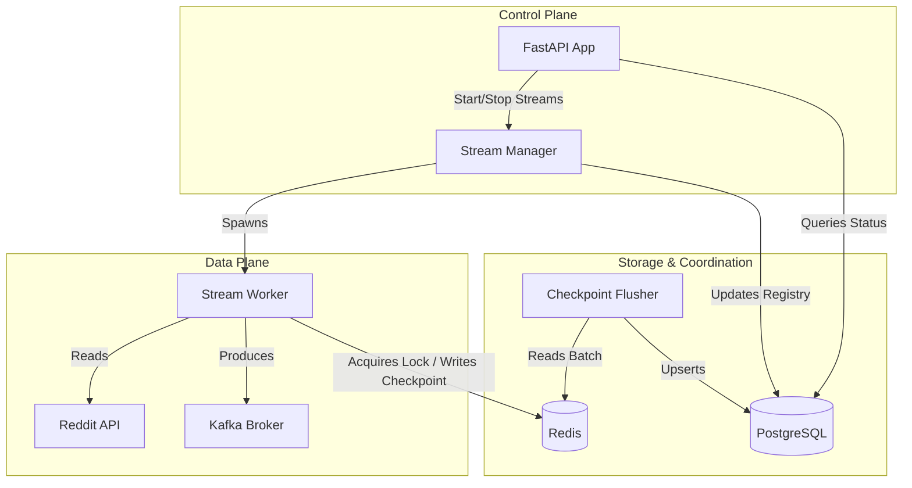
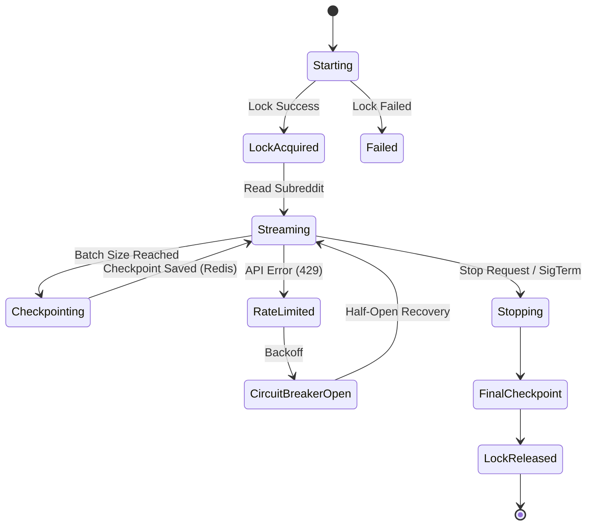
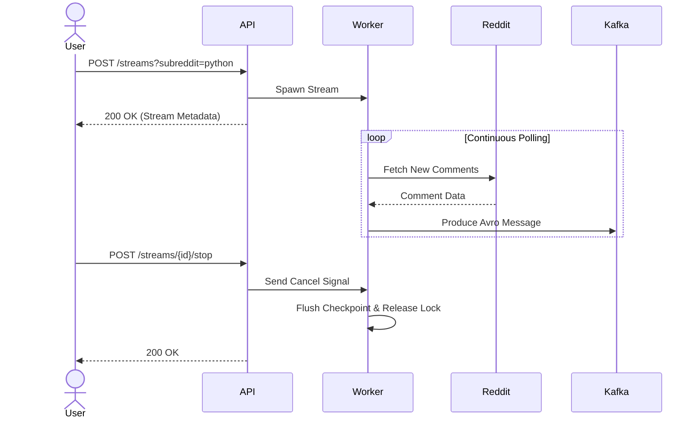

# Reddit-Kafka Streaming Platform: Comprehensive Overview

This document provides a deep-dive analysis of the `reddit-kafka` streaming platform from three distinct perspectives: **Software Architect**, **Software Developer**, and **Product Manager**. The goal is to provide a comprehensive understanding of the system's design, maintainability, value proposition, and actionable insights for future improvements.

---

## 1. Software Architect Perspective
*Focus: System design, architecture patterns, scalability, and resilience.*

### Architecture Overview
The platform employs a robust event-driven, distributed architecture designed for high-throughput, fault-tolerant ingestion of Reddit streams into a Kafka backbone.

- **Control Plane**: A FastAPI-based HTTP API acts as the management layer to start, stop, and monitor streams.
- **Data Plane (Workers)**: Async workers pull data from Reddit via `asyncpraw` and produce Avro-serialized messages to Kafka using `confluent_kafka`.
- **Hot-Path Storage**: Redis is heavily utilized for low-latency operations, specifically for maintaining distributed locks (`DistributedLockManager`) to prevent duplicate workers, and for fast, temporary checkpoint storage.
- **Durable Storage**: PostgreSQL is used as the source of truth for the stream registry and durable checkpoints.
- **Write-Behind Pattern**: To alleviate database contention during high-velocity streams, a `CheckpointFlusher` acts as a write-behind cache, periodically flushing checkpoints from Redis to Postgres in batches.

### System Architecture Diagram

### Scalability & Fault Tolerance
- **Distributed Coordination**: The Redis lock ensures only one worker streams a specific subreddit globally, even across multiple API instances. 
- **Resilience Mechanisms**: 
  - The `CircuitBreaker` pattern wraps Reddit API calls to prevent cascading failures.
  - The `ErrorHandler` categorizes errors to apply appropriate recovery strategies (e.g., immediate retry, exponential backoff, or stream abandonment).
- **Graceful Degradation**: Cancel-safe workers ensure that when a node shuts down, final checkpoints are written to Redis, and locks are released gracefully.

### Actionable Architectural Insights
- **Locking Mechanism**: The current Redis lock is sufficient for a simple setup but might suffer from split-brain scenarios during network partitions. Consider evaluating **RedLock** or Zookeeper/etcd if strict exactly-once worker placement is required.
- **Observability**: The architecture currently lacks distributed tracing and centralized metrics. Integrating OpenTelemetry and Prometheus would significantly improve architectural visibility.

---

## 2. Software Developer Perspective
*Focus: Code structure, implementation details, and maintainability.*

### Codebase Organization
The repository adheres to clean, modular, and domain-driven design principles.

- `src/app.py`: Central wiring of FastAPI, dependencies, and background tasks using modern FastAPI lifespans.
- `src/stream/`: Core domain logic encapsulating the `StreamWorker`, `CircuitBreaker`, `ErrorHandler`, and `DistributedLockManager`.
- `src/tasks/`: Background routines like `CheckpointFlusher` and `DeadStreamCleanup`.
- `src/repositories/`: Data access layers isolating SQL/Redis queries from business logic.

### Implementation Details
- **Asynchronous I/O**: The codebase makes heavy use of Python's `asyncio` ecosystem (`asyncpraw`, `redis.asyncio`, `SQLAlchemy` async sessions).
- **Typing and Linting**: The project enforces strict typing using `mypy` and modern linting/formatting via `ruff`. This dramatically improves developer confidence during refactoring.
- **Schema Validation**: Avro serialization is enforced before messages hit Kafka, ensuring downstream consumers receive strongly-typed data.

### Worker Lifecycle Diagram

### Actionable Developer Insights
- **Testing**: While unit tests exist (using `pytest` and `pytest-asyncio`), integration tests utilizing `testcontainers` (for Redis, Postgres, and Kafka) would provide higher confidence for the `CheckpointFlusher` and `DistributedLockManager`.
- **Kafka Producer Async**: The current confluent-kafka producer usage requires calling `.poll(0)` inline. Consider evaluating `aiokafka` for a more native `asyncio` integration, eliminating potential blocking calls in the async event loop.

---

## 3. Product Manager Perspective
*Focus: Features, usability, user flows, and business value.*

### Product Value
The platform delivers a highly reliable, on-demand ingestion engine for Reddit data. It is perfectly suited as the foundational data pipeline for NLP models, sentiment analysis dashboards, or AI training data generation.

### Usability & User Flows
- **API First**: The control plane provides a simple, clean HTTP API to start and stop streams on demand.
- **Easy Onboarding**: The inclusion of a comprehensive `docker-compose.yml` makes local deployment trivial for new developers or trial evaluations.

### Stream Lifecycle Workflow

### Actionable Product Insights
- **Administrative UI**: Currently, managing streams requires making cURL/HTTP requests. Developing a lightweight Dashboard UI (e.g., built with React or Streamlit) would allow operators to visually monitor active streams, error rates, and Kafka throughput.
- **Configurable Rate Limits**: Instead of hardcoded backoffs, allowing dynamic configuration of rate limits via the API or a centralized config would offer more flexibility for premium Reddit API tiers.
- **Webhooks/Alerting**: Implementing webhooks to notify users when a stream enters a fatal error state (e.g., subreddit banned or locked) would dramatically improve the operational experience.
