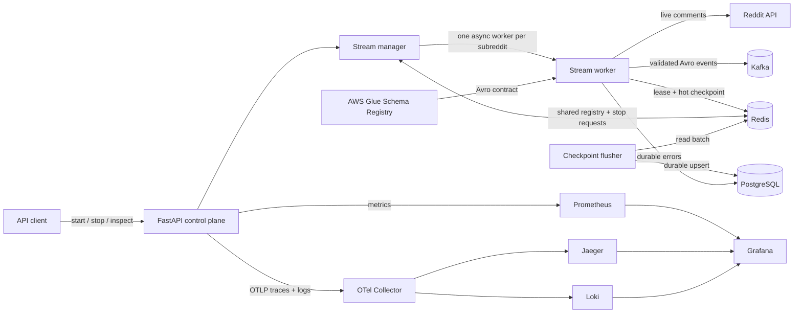

# Distributed Reddit-to-Kafka Streaming Service

An on-demand ingestion platform that converts live Reddit comments into
schema-governed Kafka events. The project focuses on the distributed-systems work
behind a reliable stream—not just calling the Reddit API: multi-instance worker
ownership, cross-instance lifecycle control, delivery-aware checkpointing, failure
recovery, durable state, and cloud infrastructure.

It is designed as a reusable upstream source for sentiment analysis, NLP pipelines,
search indexing, moderation tooling, or any system that needs a continuous feed of
Reddit text.

This root README is the canonical guide for the project. Component-specific details
remain alongside their components, such as the migration and observability guides.

## What this project demonstrates

- **Distributed coordination:** Redis leases ensure that only one application
  instance owns a subreddit at a time. Ownership tokens and atomic Lua scripts
  prevent a stale worker from refreshing or deleting a successor's lease.
- **Asynchronous event ingestion:** each requested subreddit runs as an independent
  `asyncio` worker, reads comments through `asyncpraw`, and publishes with
  `confluent-kafka`.
- **Schema-governed events:** Pydantic validates each message before Avro
  serialization; AWS Glue Schema Registry provides a backward-compatible data
  contract for downstream consumers.
- **Crash recovery without a database write on every event:** checkpoints are kept
  on the Redis hot path and periodically batch-upserted into PostgreSQL.
- **Failure isolation:** retryable, rate-limited, fatal, malformed-message, Kafka
  delivery, and lock-loss failures follow different recovery paths. Operational
  errors are retained in Redis and persisted to PostgreSQL.
- **Three-pillar observability:** bounded-cardinality Prometheus metrics,
  trace-correlated JSON logs, OpenTelemetry spans for HTTP, Reddit, AWS Glue, Redis,
  SQL, workers, and background tasks, plus W3C trace propagation through Kafka
  headers.
- **Production-oriented delivery:** the repository includes a non-root multi-stage
  container, a deterministic migration runner, a containerized development stack,
  a two-instance end-to-end harness, and Terraform for an AWS deployment.

## Architecture



The service separates the **control plane** (HTTP requests and stream lifecycle)
from the **data plane** (long-running Reddit-to-Kafka workers). Because coordination
lives in Redis rather than process memory, one API instance can stop a stream owned
by another instance.

### Stream lifecycle

1. `POST /streams` validates that the subreddit is accessible.
2. The registry atomically claims the subreddit and assigns it a stable stream ID.
3. The manager acquires a 60-second, token-owned Redis lease and starts a worker.
4. The worker refreshes its lease every 30 seconds and fails closed if ownership can
   no longer be proved.
5. Comments are validated, Avro-serialized, and queued for Kafka. At each 100-comment
   boundary, the producer is flushed before the checkpoint advances.
6. Redis checkpoints are asynchronously persisted to PostgreSQL by a write-behind
   flusher. Shutdown stops workers, flushes Kafka, persists remaining checkpoints,
   and releases owned leases.

## Engineering decisions

| Concern | Implementation | Why it matters |
| --- | --- | --- |
| Duplicate workers | `SET NX EX` Redis lease with a unique token per acquisition | Supports multiple API replicas without two workers intentionally streaming the same subreddit |
| Stale-owner safety | Compare-and-refresh and compare-and-delete Lua scripts | An expired worker cannot mutate a lease acquired by a replacement |
| Remote stop | Stop request stored in shared Redis state and polled by the owning manager | Any API replica can control any active stream |
| Checkpoint cost | Redis hot path plus batched PostgreSQL upserts | Keeps frequent coordination away from the durable database |
| Delivery boundary | Kafka delivery callbacks and a producer flush before checkpoint advancement | A reported delivery failure prevents that batch's checkpoint from moving forward |
| Schema evolution | Pydantic model + Avro + Glue compatibility policy | Producers and consumers share an explicit, versioned contract |
| Failure recovery | Error classification, circuit breaker, exponential rate-limit backoff, durable error records | Transient upstream failures do not automatically terminate unrelated streams |
| Safe cleanup | Compare-and-delete registry cleanup with stable IDs and retained checkpoints | A cleanup sweep cannot delete a concurrently restarted stream snapshot |
| Repeatable schema changes | Ordered SQL migrations tracked by SHA-256 checksum | Already-applied migrations cannot be silently edited |

## Technology stack

| Layer | Technologies |
| --- | --- |
| API and concurrency | Python 3.12, FastAPI, `asyncio`, Uvicorn |
| Source and messaging | asyncpraw, Kafka, confluent-kafka |
| State and persistence | Redis 7, PostgreSQL 16, async SQLAlchemy, asyncpg |
| Data contract | Pydantic, Avro, AWS Glue Schema Registry |
| Observability | OpenTelemetry, Prometheus, Grafana, Jaeger, Loki |
| Quality | pytest, pytest-asyncio, strict mypy, Ruff, pre-commit |
| Runtime and infrastructure | Docker Compose, Terraform, AWS ECS, MSK, Aurora PostgreSQL, ElastiCache, ALB, ECR, KMS, Secrets Manager, CloudWatch |

## API

| Method | Endpoint | Purpose |
| --- | --- | --- |
| `GET` | `/health` | Liveness check |
| `GET` | `/ready` | Redis, PostgreSQL, Kafka, and Reddit readiness |
| `GET` | `/metrics` | Prometheus exposition endpoint |
| `POST` | `/streams?subreddit={name}` | Validate a subreddit and start its stream |
| `GET` | `/streams` | List current stream metadata and status |
| `POST` | `/streams/{stream_id}/stop` | Request an idempotent local or cross-instance stop |

Example:

```bash
curl -X POST "http://localhost:8000/streams?subreddit=python"
curl "http://localhost:8000/streams"
curl -X POST "http://localhost:8000/streams/<stream-id>/stop"
```

FastAPI also exposes interactive OpenAPI documentation at
`http://localhost:8000/docs` while the service is running.

## Event contract

Kafka messages are keyed by subreddit and contain the following Avro record:

```json
{
  "subreddit": "python",
  "author_id": "example_user",
  "text": "A comment body",
  "timestamp": "2026-05-09T14:30:45.123456Z"
}
```

Deleted Reddit accounts are normalized to `"[deleted]"`, and timestamps use UTC
ISO-8601 format. The source contract is available in
[`reddit_comment.avsc`](apps/reddit-kafka/schemas/reddit_comment.avsc).

## Run locally

### Prerequisites

- Docker with Docker Compose v2
- A Reddit API application (`client_id`, `client_secret`, and `user_agent`)
- AWS credentials with access to an existing Glue registry/schema, or permission to
  provision the included schema module

The application loads its Avro schema from AWS Glue at startup. Kafka, Redis, and
PostgreSQL run locally through Docker Compose; live Reddit and Glue access are still
required for the development stack. The E2E suite replaces only those two external
boundaries with deterministic test doubles.

### Start the stack

```bash
cd apps/reddit-kafka
cp .env.sample .env
```

Add your Reddit credentials and the required schema settings to `.env`:

```dotenv
SCHEMA_REGISTRY_NAME=reddit-kafka-schemas
SCHEMA_NAME=RedditComment
SCHEMA_VERSION=1
AWS_REGION=us-east-1
USE_LOCALSTACK=false
```

For local container credentials, use your preferred AWS credential mechanism. If
you place `AWS_ACCESS_KEY_ID`, `AWS_SECRET_ACCESS_KEY`, and optionally
`AWS_SESSION_TOKEN` in `.env`, keep the file untracked; it is already covered by the
project `.gitignore`.

To provision the Glue registry and Avro schema in an AWS account:

```bash
cd schemas
terraform init
terraform apply
cd ..
```

Then start the application and its dependencies:

```bash
docker compose up --build
```

Compose creates a three-partition Kafka topic, starts PostgreSQL and Redis, runs SQL
migrations once, and exposes the API on port `8000`.

To run only the pending database migrations:

```bash
docker compose run --rm migrate
```

See the [migration guide](apps/reddit-kafka/migrations/README.md) for migration
authoring, checksum validation, and recovery procedures.

### Start the observability profile

```bash
OTEL_EXPORTER_OTLP_ENDPOINT=http://otel-collector:4317 \
  docker compose --profile observability up --build
```

This adds an OpenTelemetry Collector, Prometheus alert rules, Jaeger traces, Loki
logs, and an auto-provisioned Grafana dashboard:

- Grafana: <http://localhost:3000/d/reddit-kafka-overview> (`admin` / `admin`)
- Prometheus: <http://localhost:9090>
- Jaeger: <http://localhost:16686>

See the [observability guide](apps/reddit-kafka/observability/README.md) for the
signal catalog, initial SLOs, alert triage, privacy/cardinality decisions, and
production guidance.

## Development and verification

The project uses [`uv`](https://docs.astral.sh/uv/) and a committed lockfile for
reproducible Python environments.

```bash
cd apps/reddit-kafka
uv sync --frozen

# Unit tests
uv run --frozen pytest tests/unit -q

# Static quality gates
uv run --frozen ruff check src tests
uv run --frozen mypy src

# Full two-instance integration suite
./scripts/run-e2e.sh
```

If an E2E failure needs inspection, run the suite with `E2E_KEEP_STACK=1` to leave
its containers running after the test exits.

The current unit suite contains **70 passing test cases**. The E2E harness starts
real Kafka, Redis, PostgreSQL, and two independent application containers, then
verifies:

- concurrent stream creation has one global winner;
- cross-instance and idempotent termination;
- Kafka delivery and the Redis-to-PostgreSQL checkpoint path;
- API validation without orphaned registry state;
- transient recovery, fatal failures, and durable errors;
- lock loss, lease reacquisition, and stale-owner safety;
- dead-stream cleanup and restart identity preservation;
- migration checksums and Pydantic/Avro schema consistency.

Live-service outages and AWS/Reddit compatibility remain deployment-level smoke or
chaos-test concerns; the automated E2E tests are intentionally deterministic.

## Repository map

```text
.
├── README.md
└── apps/reddit-kafka/
    ├── src/
    │   ├── app.py                 # API wiring and graceful lifespan
    │   ├── stream/                # workers, manager, leases, recovery
    │   ├── repositories/          # Redis/PostgreSQL stream state
    │   ├── serializers/           # Glue-backed Avro serializer
    │   └── tasks/                 # checkpoint flush and dead-state cleanup
    ├── migrations/                # checksummed SQL migrations
    ├── observability/             # collector, alerts, dashboards, log/trace stores
    ├── schemas/                   # Avro contract and Glue Terraform
    ├── terraform/                 # reusable AWS infrastructure module
    ├── envs/dev/                  # development deployment composition
    ├── tests/unit/                # isolated behavioral tests
    ├── tests/e2e/                 # two-instance system tests
    ├── docker-compose.yml         # local development stack
    └── docker-compose.e2e.yml     # deterministic integration stack
```

## AWS deployment blueprint

The Terraform configuration models a multi-AZ AWS deployment with:

- ECS services behind an Application Load Balancer, with CPU and memory scaling;
- Amazon MSK with SASL/TLS, Aurora PostgreSQL, and ElastiCache Redis in private
  subnets;
- ECR image storage, Secrets Manager credentials, optional KMS encryption, and
  security-group network boundaries;
- CloudWatch log groups and alarms for application, broker, cache, and database
  signals;
- trace-correlated JSON logs and configurable OTLP export from each ECS task;
- a separate Glue Schema Registry module for the backward-compatible Avro contract.

The files are an infrastructure blueprint and are not evidence of a currently live
public deployment. Applying them creates billable AWS resources and assumes the
remote Terraform state prerequisites described in
[`envs/dev/main.tf`](apps/reddit-kafka/envs/dev/main.tf).

## Processing guarantees and trade-offs

- The pipeline favors **at-least-once recovery behavior** over exactly-once
  processing. A crash between Kafka delivery and checkpoint persistence can replay
  comments, so consumers should be idempotent if duplicates matter.
- Checkpointing every 100 comments reduces coordination overhead but defines the
  potential replay window. This interval should become configuration driven before
  tuning from production measurements.
- The Redis lease is appropriate for a single-region service but is not a consensus
  protocol. A geo-distributed deployment with stricter ownership guarantees would
  need a stronger coordination design.
- No throughput number is claimed: capacity depends on Reddit limits, Kafka
  configuration, partitioning, network conditions, and the number of active
  subreddits. The next performance step is a repeatable load test with published
  latency and throughput results.

These constraints are deliberate and documented so that downstream consumers and
future production work start with explicit semantics rather than implied guarantees.
