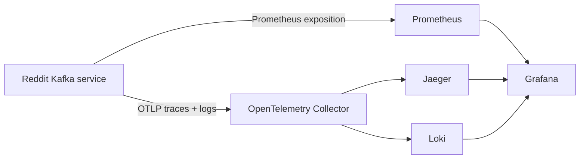

# Observability stack

The local observability profile provides one-click access to the service's metrics,
traces, and structured logs:



## Start it

From `apps/reddit-kafka`:

```bash
OTEL_EXPORTER_OTLP_ENDPOINT=http://otel-collector:4317 \
  docker compose --profile observability up --build
```

| Interface | URL | Default credentials |
| --- | --- | --- |
| Grafana dashboard | <http://localhost:3000/d/reddit-kafka-overview> | `admin` / `admin` |
| Prometheus | <http://localhost:9090> | None |
| Jaeger | <http://localhost:16686> | None |
| Raw application metrics | <http://localhost:8000/metrics> | None |
| Dependency readiness | <http://localhost:8000/ready> | None |

Set `GRAFANA_ADMIN_PASSWORD` before starting any shared environment.

## Signals

### Metrics

Metric labels are intentionally bounded. Stream IDs, subreddit names, Reddit
authors, and comment contents are excluded to control cardinality and avoid putting
user data into the metrics system.

| Signal | Metrics |
| --- | --- |
| HTTP golden signals | `reddit_kafka_http_requests_total`, `reddit_kafka_http_request_duration_seconds`, `reddit_kafka_http_requests_in_progress` |
| Stream health | `reddit_kafka_active_streams`, `reddit_kafka_stream_lifecycle_total` |
| Data plane | `reddit_kafka_reddit_comments_received_total`, `reddit_kafka_comments_total`, `reddit_kafka_comment_processing_duration_seconds`, `reddit_kafka_kafka_deliveries_total`, `reddit_kafka_kafka_delivery_bytes_total` |
| Durability | `reddit_kafka_checkpoint_flushes_total`, `reddit_kafka_checkpoint_batch_size`, `reddit_kafka_checkpoint_flush_duration_seconds` |
| Coordination | `reddit_kafka_lock_operations_total`, `reddit_kafka_circuit_breaker_transitions_total` |
| Operations | `reddit_kafka_errors_total`, `reddit_kafka_cleanup_runs_total`, `reddit_kafka_dependency_ready` |

### Traces

- Incoming W3C `traceparent` headers are continued by the HTTP middleware.
- Outbound Reddit aiohttp calls, AWS Glue SDK calls, Redis commands, and SQLAlchemy
  queries are auto-instrumented.
- Comment validation, serialization, and Kafka enqueueing use producer spans.
- W3C trace context is injected into Kafka headers for downstream consumers.
- Checkpoint flush and dead-stream cleanup tasks create dedicated spans.
- Reddit author and comment body values are never added as span attributes.

Each comment starts a new trace root because its worker outlives the API request that
created it. This avoids hours-long traces and lets sampling operate per message.

### Logs

Console logs are JSON by default and contain service, environment, instance,
severity, logger, timestamp, request ID, and—inside a sampled trace—trace and span
IDs. The OTLP log pipeline sends the same records through the collector to Loki.
Grafana's Loki datasource turns a `trace_id` field into a direct Jaeger link.

The dashboard separates intake from durable handoff: Reddit comments observed,
processing outcomes, Kafka-acknowledged messages, and acknowledged payload bytes.
These are service-lifetime counters; use Prometheus `rate()` or `increase()` for
throughput and time-window totals. Restarting a process resets its local counters,
so production totals should be aggregated across instances and persisted in
Prometheus-compatible storage.

## Alerts and initial SLOs

The bundled Prometheus rules cover target availability, API 5xx ratio, API p95
latency, Kafka delivery errors, checkpoint failures, and active streams without
recent delivery. They are starting points, not universal thresholds.

A sensible first production objective is:

- control-plane availability: 99.9% of non-health requests return below 500;
- control-plane latency: 95% of requests complete within one second;
- delivery reliability: zero reported Kafka delivery failures;
- durability: zero failed checkpoint batches;
- freshness: an active stream records a delivery within five minutes.

Tune those objectives only after measuring real Reddit traffic and expected
subreddit activity. A quiet subreddit can legitimately trigger the freshness rule.

### Triage order

1. Check `/ready` to separate application liveness from Redis, PostgreSQL, Kafka,
   or Reddit initialization failures.
2. Open the Grafana overview and compare active workers, delivery rate, errors, and
   checkpoint latency.
3. Use the correlated log's trace ID to open its Jaeger trace.
4. For delivery failures, inspect broker health and producer spans before restarting
   a worker; replay is possible after the last checkpoint.
5. For lease failures, confirm Redis availability and look for
   `stream_lifecycle_total{transition="lease",result="lost"}`.

## Production guidance

- Keep one application process per container and scale containers horizontally.
  Prometheus process metrics and in-memory worker gauges then have unambiguous
  ownership.
- Use TLS and authentication between the service and a managed or separately
  deployed collector. Do not expose `/metrics`, Jaeger, Loki, or Grafana publicly.
  The included ALB rules block public `/metrics` access while leaving it reachable
  to an internal task-network scraper.
- Start with a lower `OTEL_TRACE_SAMPLE_RATIO` (for example `0.1`) and use a
  collector tail-sampling policy to retain errors and slow traces.
- Set storage retention and resource limits for Prometheus, Loki, and the trace
  backend. The local filesystem configuration is for development only.
- Route Prometheus alerts through Alertmanager or the platform's incident system.
- Treat logs and traces as potentially sensitive operational data even though the
  instrumentation deliberately excludes comment text and author names.
